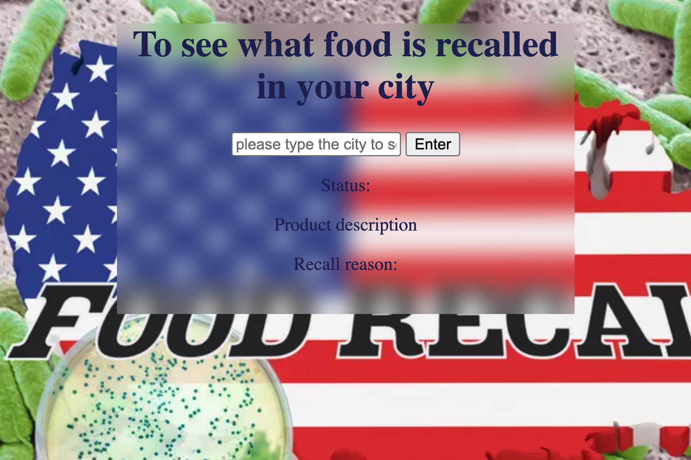
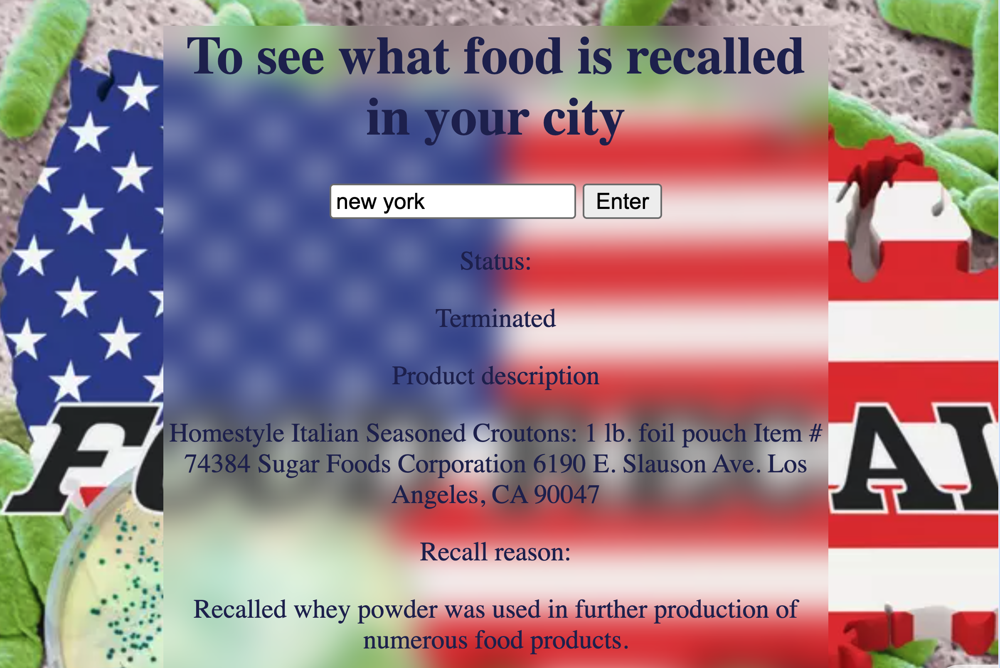

# Food recall look up app

A simple front-end app that displays data from an FDA api to help restaurant staff and managers. 
This app offers user to look up recent recall food according to the location user enters.

- Screenshots:




## How It's Made

**Tech Used:** HTML, CSS, JavaScript, FDA api

The app uses JavaScript's `fetch()` to request data from FDA api and displays the result on the page. 


## Getting Started

1. Clone this repository

```bash
   git clone https://github.com/sabrinalindev/restaurant.git
```

2. Open `index.html` in your browser

## How to Use

1. Step 1: e.g. Enter city you want to look up
2. Step 2: e.g. Click the Search button
3. Step 3: e.g. View the results displayed on the page

## Features

- Fetches live data from FDA api
- No installation or dependencies needed

## Why This Stack

- **JavaScript (`fetch`)**: Handles the API request and renders the data dynamically without a page reload.
- **HTML/CSS**: Simple, fast to load, and perfect for a lightweight front-end app.
- **FDA api**: Free, easy to use, and provides data useful for food recall.

## Future Improvements

- Display recent multiple data results
